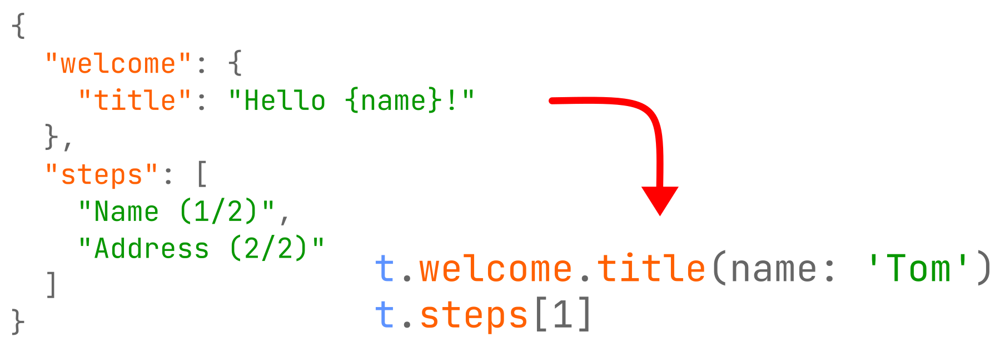

# fast_i18n

The official documentation is [here](https://github.com/Tienisto/flutter-fast-i18n/tree/master/fast_i18n).

## Projects

- [fast_i18n](https://github.com/Tienisto/flutter-fast-i18n/tree/master/fast_i18n) (core)
- [fast_i18n_dart](https://github.com/Tienisto/flutter-fast-i18n/tree/master/fast_i18n_dart) (dart support)
- [fast_i18n_flutter](https://github.com/Tienisto/flutter-fast-i18n/tree/master/fast_i18n_flutter) (flutter support)
