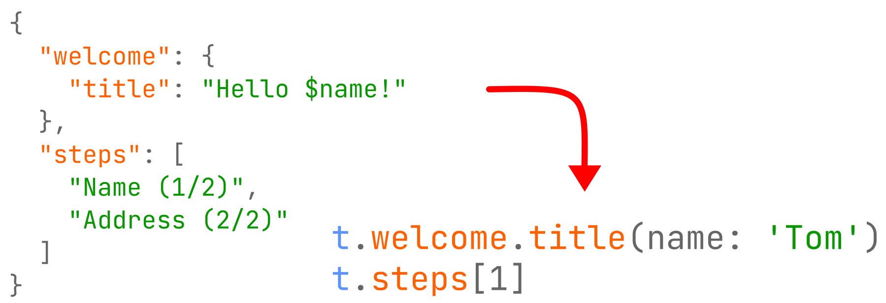

# fast_i18n

Lightweight i18n solution. Use JSON files to create typesafe translations.

**For flutter web users:** version `3.0.4` contains the workaround for [#79555](https://github.com/flutter/flutter/issues/79555).
Version 4.x.x is web compatible as soon as the Flutter team merge this fix into the stable branch.

**For legacy users:** version `4.x.x-legacy` is built on `build 1.3.0`, `glob 1.2.0`, `yaml 2.2.1` and `build_runner 1.10.2`. This way, you can access the latest features in your legacy project.

## About this library

- 🚀 Minimal setup, create JSON files and get started! No configuration needed.
- 📦 Self-contained, you can remove this library after generation.
- 🐞 Bug-resistant, no typos or missing arguments possible due to compiler errors.
- ⚡ Fast, you get translations using native dart method calls, zero parsing!
- 🔨 Configurable, English is not the default language? Configure it in `build.yaml`!

You can see an example of the generated file [here](https://github.com/Tienisto/flutter-fast-i18n/blob/master/example/lib/i18n/strings.g.dart).

This is how you access the translations:

```dart
final t = Translations.of(context); // optional, there is also a static getter without context

String a = t.mainScreen.title;                             // simple use case
String b = t.game.end.highscore(name: 'Tom', score: 32.6); // with parameters
String c = t.items(count: 2);                              // with pluralization (using count)
String d = t.intro.step[4];                                // with index
String e = t.error.type['WARNING'];                        // with dynamic key
String f = t['mainScreen.title'];                          // with fully dynamic key
```

## Table of Contents

- [Getting Started](#getting-started)
- [Configuration](#configuration)
- [Features](#features)
    - [String Interpolation](#string-interpolation)
    - [Pluralization](#pluralization)
    - [Maps](#maps)
    - [Dynamic Keys](#dynamic-keys)
    - [Lists](#lists)
- [API](#api)
- [FAQ](#faq)

## Getting Started

**Step 1: Add dependencies**

It is recommended to add `fast_i18n` to `dev_dependencies`.

```yaml
dev_dependencies:
  build_runner: any
  fast_i18n: 4.7.2
```

**Step 2: Create JSON files**

Create these files inside your `lib` directory. Preferably in one common package like `lib/i18n`.
Only files having the `.i18n.json` file extension will be detected.
The part after the underscore `_` is the actual locale (e.g. en_US, en-US, fr).
You **must** provide the default translation file (the file without locale extension).

`strings.i18n.json (mandatory, default, fallback)`

```json
{
  "hello": "Hello $name",
  "save": "Save",
  "login": {
    "success": "Logged in successfully",
    "fail": "Logged in failed"
  }
}
```

`strings_de.i18n.json`

```json
{
  "hello": "Hallo $name",
  "save": "Speichern",
  "login": {
    "success": "Login erfolgreich",
    "fail": "Login fehlgeschlagen"
  }
}
```

**Step 3: Generate the dart code**

```
flutter pub run fast_i18n
```
alternative (but slower):
```
flutter pub run build_runner build --delete-conflicting-outputs
```

**Step 4: Initialize**

a) use device locale
```dart
void main() {
  WidgetsFlutterBinding.ensureInitialized(); // add this
  LocaleSettings.useDeviceLocale(); // and this
  runApp(MyApp());
}
```

b) use specific locale
```dart
@override
void initState() {
  super.initState();
  String storedLocale = loadFromStorage(); // your logic here
  LocaleSettings.setLocaleRaw(storedLocale);
}
```

**Step 4a: Override 'supportedLocales'**

This is optional but recommended.

Standard flutter controls (e.g. back button's tooltip) will also pick the right locale.

```dart
MaterialApp(
  localizationsDelegates: const [
    GlobalMaterialLocalizations.delegate,
    GlobalWidgetsLocalizations.delegate,
    GlobalCupertinoLocalizations.delegate,
  ],
  supportedLocales: LocaleSettings.supportedLocales, // <---
)
```

**Step 4b: iOS configuration**

```
File: ios/Runner/Info.plist

<key>CFBundleLocalizations</key>
<array>
   <string>en</string>
   <string>de</string>
</array>
```

**Step 5: Use your translations**

```dart
import 'package:my_app/i18n/strings.g.dart'; // import

String a = t.login.success; // plain
String b = t.hello(name: 'Tom'); // with argument
String c = t.step[3]; // with index (for arrays)
String d = t.type['WARNING']; // with key (for maps)

// advanced
TranslationProvider(child: MyApp()); // wrap your app with TranslationProvider
// [...]
final t = Translations.of(context); // forces a rebuild on locale change
String translateAdvanced = t.hello(name: 'Tom');
```

## Configuration

This is **optional**. This library works without any configuration (in most cases).

For customization, you can create the `build.yaml` file. Place it in the root directory.

```yaml
targets:
  $default:
    builders:
      fast_i18n:i18nBuilder:
        options:
          null_safety: true
          base_locale: fr
          input_directory: lib/i18n
          input_file_pattern: .i18n.json
          output_directory: lib/i18n
          output_file_pattern: .g.dart
          translate_var: t
          enum_name: AppLocale
          translation_class_visibility: private
          key_case: snake
          string_interpolation: double_braces
          maps:
            - error.codes
            - category
            - iconNames
          pluralization:
            cardinal:
              - someKey.apple
            ordinal:
              - someKey.place
```

Key|Type|Usage|Default
---|---|---|---
null_safety|`Boolean`|generate null safe code|`true / auto`
base_locale|`String`|locale of default json|`en`
input_directory|`String`|path to input directory|`null`
input_file_pattern|`String`|input file pattern|`.i18n.json`
output_directory|`String`|path to output directory|`null`
output_file_pattern|`String`|output file pattern|`.g.dart`
translate_var|`String`|translate variable name|`t`
enum_name|`String`|enum name|`AppLocale`
translation_class_visibility|`private`, `public`|class visibility|`private`
key_case|`camel`, `pascal`, `snake`|transform keys (optional)|`null`
string_interpolation|`dart`, `braces`, `double_braces`|string interpolation mode|`dart`
maps|`List<String>`|entries which should be accessed via keys|`[]`
pluralization/cardinal|`List<String>`|entries which have cardinals|`[]`
pluralization/ordinal|`List<String>`|entries which have ordinals|`[]`

## Features

### String Interpolation

There are three modes configurable via `string_interpolation`:

Mode|Example
---|---
`dart (default)`|`Hello $name or ${name2}`
`braces`|`Hello {name}`
`double_braces`|`Hello {{name}}`

You can always escape them by adding a backslash, e.g. `\{notAnArgument}`.

```json
{
  "greeting": "Hello $name",
  "distance": "${distance}m"
}
```

```dart
t.greeting(name: 'Tom'); // Hello Tom
t.distance(distance: 4.5); // 4.5m
```

### Pluralization

This library uses the concept defined [here](https://unicode-org.github.io/cldr-staging/charts/latest/supplemental/language_plural_rules.html).

Some languages have support out of the box. See [here](https://github.com/Tienisto/flutter-fast-i18n/blob/master/lib/src/model/pluralization_resolvers.dart).

In order to use plurals, please add the key paths to `build.yaml`.
Next, add the required quantities to the translation file. You can access the `num count` but it is optional.

`strings.i18n.json`
```json
{
  "someKey": {
    "apple": {
      "one": "I have $count apple.",
      "other": "I have $count apples."
    },
    "place": {
      "one": "${count}st place.",
      "two": "${count}nd place.",
      "few": "${count}rd place.",
      "other": "${count}th place."
    }
  }
}
```

`build.yaml`
```yaml
targets:
  $default:
    builders:
      fast_i18n:i18nBuilder:
        options:
          pluralization:
            cardinal:
              - someKey.apple
            ordinal:
              - someKey.place
```

Now you can access them.
```dart
String a = t.someKey.apple(count: 1); // I have 1 apple.
String b = t.someKey.apple(count: 2); // I have 2 apples.
```

In case your language is not supported, you must provide a custom pluralization resolver:
```dart
// add this before you call the pluralization strings. Otherwise an exception will be thrown.
LocaleSettings.setPluralResolver(
  language: 'en',
  cardinalResolver: (num n, {String? zero, String? one, String? two, String? few, String? many, String? other}) {
    if (n == 0)
      return zero ?? other!;
    if (n == 1)
      return one ?? other!;
    return other!;
  },
  ordinalResolver: (num n, {String? zero, String? one, String? two, String? few, String? many, String? other}) {
    if (n % 10 == 1 && n % 100 != 11)
      return one ?? other!;
    if (n % 10 == 2 && n % 100 != 12)
        return two ?? other!;
    if (n % 10 == 3 && n % 100 != 13)
        return few ?? other!;
    return other!;
  },
);
```

### Maps

You can access each translation via string keys by defining maps.

Define the maps in your `build.yaml`. Each configuration item represents the translation tree separated by dots.

Keep in mind that all nice features like autocompletion are gone.

`strings.i18n.json`
```json
{
  "welcome": "Welcome",
  "thisIsAMap": {
    "hello world": "hello"
  },
  "notAMapParent": {
    "notAMap": "hello",
    "aMapInClass": {
      "hi": "hi"
    }
  }
}
```

`build.yaml`
```yaml
targets:
  $default:
    builders:
      fast_i18n:i18nBuilder:
        options:
          maps:
            - thisIsAMap
            - notAMapParent.aMapInClass
```

Now you can access the translations via keys:

```dart
String a = t.thisIsAMap['hello world'];
String b = t.notAMapParent.notAMap; // the "classical" way
String c = t.notAMapParent.aMapInClass['hi']; // nested
```

### Dynamic Keys

A more general solution for [Maps](#maps).

It is supported out of the box. No configuration needed. Please use this sparingly.

```dart
String a = t['myPath.anotherPath'];
String b = t['myPath.anotherPath.3']; // with index for arrays
String c = t['myPath.anotherPath'](name: 'Tom'); // with arguments
```

### Lists

Lists are fully supported. No configuration needed. You can also put lists or maps inside lists!

```json
{
  "niceList": [
    "hello",
    "nice",
    [
      "first item in nested list",
      "second item in nested list"
    ],
    {
      "wow": "WOW!",
      "ok": "OK!"
    },
    {
      "a map entry": "access via key",
      "another entry": "access via second key"
    }
  ]
}
```

```dart
String a = t.niceList[1]; // "nice"
String b = t.niceList[2][0]; // "first item in nested list"
String c = t.niceList[3].ok; // "OK!"
String d = t.niceList[4]['a map entry']; // "access via key"
```

## API                                                                                   
                                                                                         
When the dart code has been generated, you will see some useful classes and functions    
                                                                                         
`t` - the translate variable for simple translations                                     
                                                                                         
`Translations.of(context)` - translations which reacts to locale changes                 
                                                                                         
`TranslationProvider` - App wrapper, used for `Translations.of(context)`                 
                                                                                         
`LocaleSettings.useDeviceLocale()` - use the locale of the device                        
                                                                                         
`LocaleSettings.setLocale(AppLocale.en)` - change the locale                             
                                                                                         
`LocaleSettings.setLocaleRaw('de')` - change the locale                                  
                                                                                         
`LocaleSettings.currentLocale` - get the current locale                                  
                                                                                         
`LocaleSettings.baseLocale` - get the base locale                                        
                                                                                         
`LocaleSettings.supportedLocalesRaw` - get the supported locales                         
                                                                                         
`LocaleSettings.supportedLocales` - see step 4a                                          
                                                                                         
`LocaleSettings.setPluralResolver` - set pluralization resolver for unsupported languages

## FAQ

**Can I write the json files in the asset folder?**

Yes. Specify `input_directory` and `output_directory` in `build.yaml`.

```yaml
targets:
  $default:
    builders:
      fast_i18n:i18nBuilder:
        options:
          input_directory: assets/i18n
          output_directory: lib/i18n
```

**Why setLocale doesn't work?**

In most cases you forgot the `setState` call.

A more elegant solution is to use `TranslationProvider(child: MyApp())` and then get you translation variable with `final t = Translations.of(context)`.
It will automatically trigger a rebuild on `setLocale` for all affected widgets.

## License

MIT License

Copyright (c) 2020-2021 Tien Do Nam

Permission is hereby granted, free of charge, to any person obtaining a copy
of this software and associated documentation files (the "Software"), to deal
in the Software without restriction, including without limitation the rights
to use, copy, modify, merge, publish, distribute, sublicense, and/or sell
copies of the Software, and to permit persons to whom the Software is
furnished to do so, subject to the following conditions:

The above copyright notice and this permission notice shall be included in all
copies or substantial portions of the Software.

THE SOFTWARE IS PROVIDED "AS IS", WITHOUT WARRANTY OF ANY KIND, EXPRESS OR
IMPLIED, INCLUDING BUT NOT LIMITED TO THE WARRANTIES OF MERCHANTABILITY,
FITNESS FOR A PARTICULAR PURPOSE AND NONINFRINGEMENT. IN NO EVENT SHALL THE
AUTHORS OR COPYRIGHT HOLDERS BE LIABLE FOR ANY CLAIM, DAMAGES OR OTHER
LIABILITY, WHETHER IN AN ACTION OF CONTRACT, TORT OR OTHERWISE, ARISING FROM,
OUT OF OR IN CONNECTION WITH THE SOFTWARE OR THE USE OR OTHER DEALINGS IN THE
SOFTWARE.
