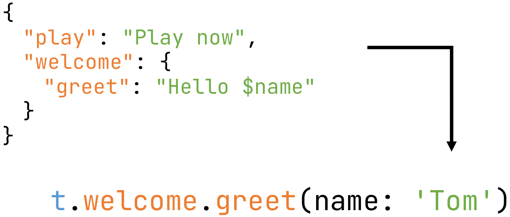

# fast_i18n

Lightweight i18n solution. Use JSON files to create typesafe translations.

## Getting Started

**Step 1: Add dependencies**

```yaml
dependencies:
  fast_i18n: ^3.0.0

dev_dependencies:
  build_runner: any
```

**Step 2: Create JSON files**

Create these files inside your `lib` directory. Preferably in one common package like `lib/i18n`.

`strings.i18n.json (default, fallback)`

```json
{
  "hello": "Hello $name",
  "save": "Save",
  "login": {
    "success": "Logged in successfully",
    "fail": "Logged in failed"
  }
}
```

`strings_de.i18n.json`

```json
{
  "hello": "Hallo $name",
  "save": "Speichern",
  "login": {
    "success": "Login erfolgreich",
    "fail": "Login fehlgeschlagen"
  }
}
```

**Step 3: Generate the dart code**

```
flutter pub run build_runner build
```

**Step 4: Initialize**

a) use device locale
```dart
void main() {
  WidgetsFlutterBinding.ensureInitialized();
  LocaleSettings.useDeviceLocale();
  runApp(MyApp());
}
```

b) use specific locale
```dart
@override
void initState() {
  super.initState();
  String storedLocale = loadFromStorage(); // your logic here
  LocaleSettings.setLocale(storedLocale);
}
```

**Step 4a: Override 'supportedLocales'**

This is optional but recommended.

Standard flutter controls (e.g. back button's tooltip) will also pick the right locale.

```dart
MaterialApp(
  localizationsDelegates: const [
    GlobalMaterialLocalizations.delegate,
    GlobalWidgetsLocalizations.delegate,
    GlobalCupertinoLocalizations.delegate,
  ],
  supportedLocales: LocaleSettings.supportedLocales, // <---
)
```

**Step 4b: iOS configuration**

```
File: ios/Runner/Info.plist

<key>CFBundleLocalizations</key>
<array>
   <string>en</string>
   <string>de</string>
</array>
```

**Step 5: Use your translations**

```dart
// raw string
String translated = t.hello(name: 'Tom');

// inside component
Text(t.login.success)

// advanced
TranslationProvider(child: MyApp()); // wrap your app with the TranslationProvider
final t = Translations.of(context); // reacts on locale changes
String translateAdvanced = t.hello(name: 'Tom');
```

## API

When the dart code has been generated, you will see some useful classes and functions

`t` - the translate variable for simple translations

`Translations.of(context)` - translations which reacts to locale changes

`TranslationProvider` - App wrapper, used for `Translations.of(context)`

`LocaleSettings.useDeviceLocale()` - use the locale of the device

`LocaleSettings.setLocale('de')` - change the locale

`LocaleSettings.currentLocale` - get the current locale

`LocaleSettings.locales` - get the supported locales

## Configuration

All settings can be set in the `build.yaml` file. Place it in the root directory.

```yaml
targets:
  $default:
    builders:
      fast_i18n:i18nBuilder:
        options:
          base_locale: en
          input_directory: lib/i18n
          input_file_pattern: .i18n.json
          output_directory: lib/i18n
          output_file_pattern: .g.dart
          output_translate_var: t
          key_case: snake
          maps:
            - a
            - b
            - c.d
```

Key|Type|Usage|Default
---|---|---|---
base_locale|`String`|locale of default json|`en`
input_directory|`String`|path to input directory|`null (whole project)`
input_file_pattern|`String`|input file pattern|`.i18n.json`
output_directory|`String`|path to output directory|`null (whole project)`
output_file_pattern|`String`|output file pattern|`.g.dart`
output_translate_var|`String`|translate variable name|`t`
key_case|`snake` or `camel`|transform keys to snake or camel case|`null (no transform)`
maps|`List<String>`|entries which should be accessed via keys|`[]`

## Additional features

**Maps**

Sometimes you need to access the translations via keys.
Define the maps in your `config.i18n.json`.
Keep in mind that all nice features like autocompletion are gone.

`strings.i18n.json`
```json
{
  "welcome": "Welcome",
  "thisIsAMap": {
    "hello world": "hello"
  },
  "classicClass": {
    "hello": "hello",
    "aMapInClass": {
      "hi": "hi"
    }
  }
}
```

`build.yaml`
```yaml
targets:
  $default:
    builders:
      fast_i18n:i18nBuilder:
        options:
          maps:
            - thisIsAMap
            - classicClass.aMapInClass
```

Now you can access this via key:

```dart
String a = t.thisIsAMap['hello world'];
String b = t.classicClass.hello; // the "classical" way
String c = t.classicClass.aMapInClass['hi']; // nested
```

**Lists**

Lists are fully supported.

```json
{
  "niceList": [
    "hello",
    "nice",
    [
      "nestedList"
    ],
    {
      "wow": "wow"
    },
    {
      "a map entry": "cool"
    }
  ]
}
```

```dart
String a = t.niceList[1];
String b = t.niceList[2][0];
String c = t.niceList[3].wow;
String d = t.niceList[4]['a map entry'];
```

## License

MIT License

Copyright (c) 2020 Tien Do Nam

Permission is hereby granted, free of charge, to any person obtaining a copy
of this software and associated documentation files (the "Software"), to deal
in the Software without restriction, including without limitation the rights
to use, copy, modify, merge, publish, distribute, sublicense, and/or sell
copies of the Software, and to permit persons to whom the Software is
furnished to do so, subject to the following conditions:

The above copyright notice and this permission notice shall be included in all
copies or substantial portions of the Software.

THE SOFTWARE IS PROVIDED "AS IS", WITHOUT WARRANTY OF ANY KIND, EXPRESS OR
IMPLIED, INCLUDING BUT NOT LIMITED TO THE WARRANTIES OF MERCHANTABILITY,
FITNESS FOR A PARTICULAR PURPOSE AND NONINFRINGEMENT. IN NO EVENT SHALL THE
AUTHORS OR COPYRIGHT HOLDERS BE LIABLE FOR ANY CLAIM, DAMAGES OR OTHER
LIABILITY, WHETHER IN AN ACTION OF CONTRACT, TORT OR OTHERWISE, ARISING FROM,
OUT OF OR IN CONNECTION WITH THE SOFTWARE OR THE USE OR OTHER DEALINGS IN THE
SOFTWARE.